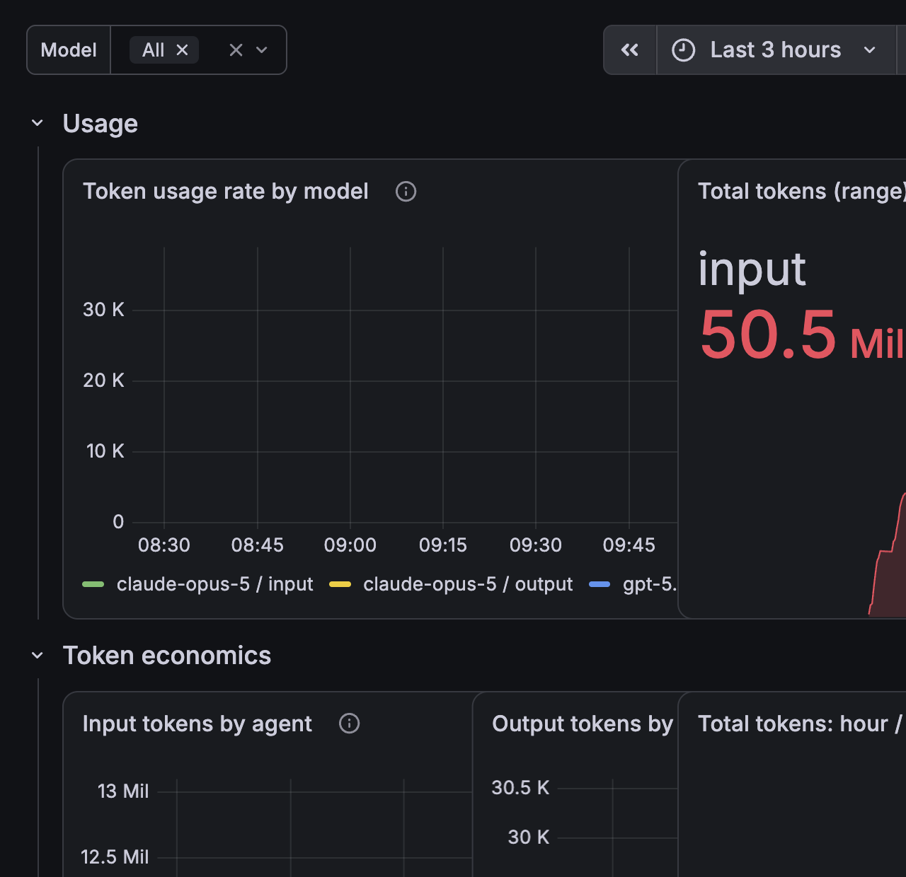
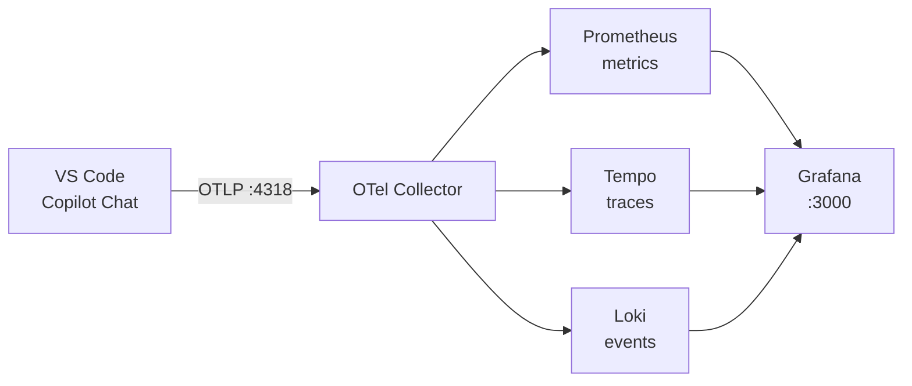
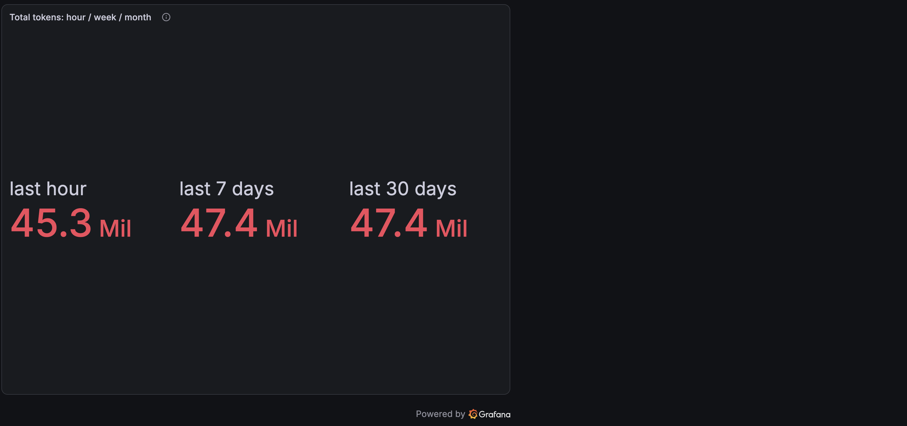
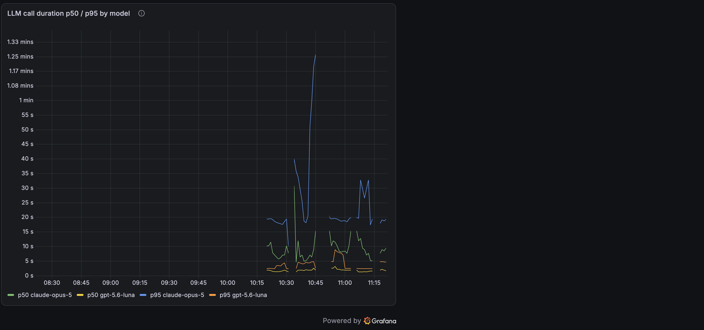
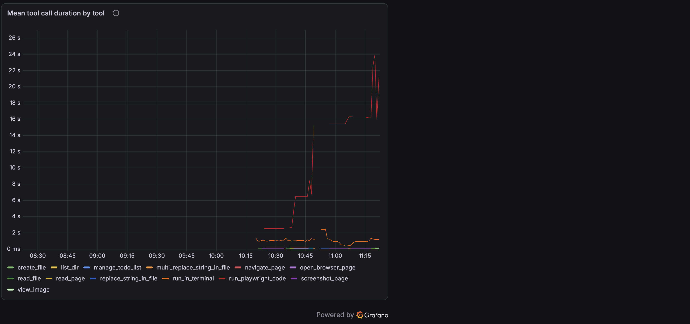
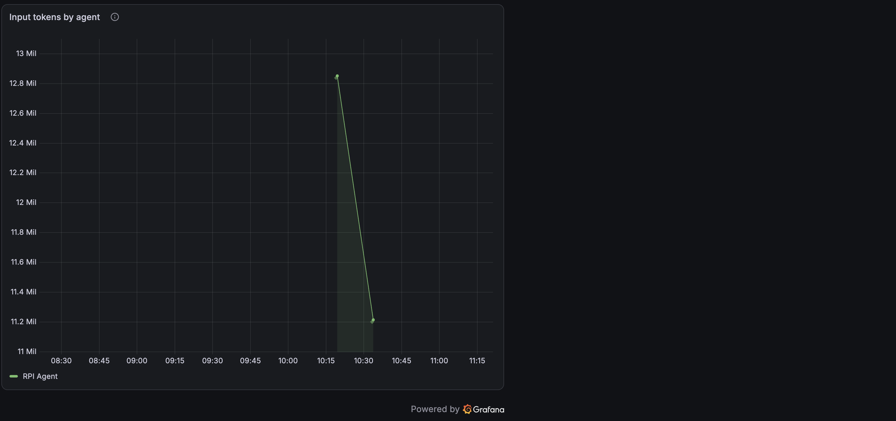
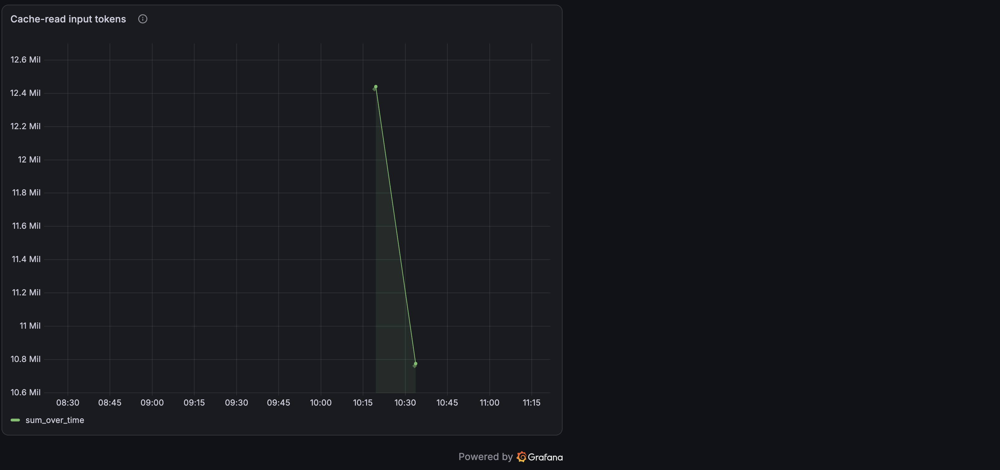
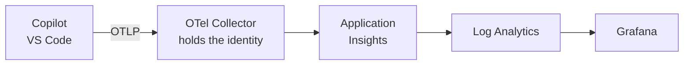

GitHub Copilot Chat can export traces, metrics, and events over OpenTelemetry. Point it at a collector you run yourself and you get a measured view of your own agent sessions: which models you use, how long calls take, which tools run most, how many tokens you burn, and how much of that is cache.

Everything below runs on one machine, in one container, and sends nothing anywhere. You do not need an administrator to try it.

:::tip Let the skill do it
The [`copilot-otel-metrics` skill](https://github.com/microsoft/hve-core/blob/main/.github/skills/experimental/copilot-otel-metrics/SKILL.md) walks this guide for you.
Invoke it explicitly with `/copilot-otel-metrics`; it does not activate on its own.
It can write the settings after showing you an exact diff, generate the stack and a dashboard, and generate the collector configuration, Bicep, Terraform, and Azure CLI for an organization.
It generates and hands over; it never runs `docker compose`, `az deployment`, or `terraform apply`.
:::



## You probably do not need an administrator

The VS Code documentation renders a badge next to most OTel settings reading "This setting is managed at the organization level. Contact your administrator to change it." That badge means the setting *can* be governed by policy, not that it *is*.

The shipped extension manifest declares a `policyReference` but no applied `policy` value, and the documented resolution order is policy, then environment variable, then user setting, then default. With no policy present, your user setting wins.

If you are unsure whether a policy applies to you, run **Developer: Policy Diagnostics** from the command palette. It reports exactly which managed settings are enforced on your device.

## What Copilot emits

Three signal types, each answering a different kind of question.

| Signal  | Examples                                                     | Good for                                      |
|---------|--------------------------------------------------------------|-----------------------------------------------|
| Metrics | `gen_ai.client.token.usage`, `copilot_chat.tool.call.count`  | Rates, totals, percentiles, long-range trends |
| Traces  | `invoke_agent`, `chat`, `execute_tool`, `execute_hook` spans | Causality, per-session detail, attribution    |
| Events  | `copilot_chat.session.start`, `copilot_chat.tool.call`       | Discrete occurrences                          |

:::warning Names in this guide are a snapshot
Every signal, metric, and attribute name on this page came from one extension build at one moment, and the emitted surface follows the extension rather than this document. Settle names against your own store with `inspect_metrics.py`, and settle settings against the installed extension manifest. A wrong metric name fails silently: Prometheus returns an empty result and Grafana renders an empty panel, indistinguishable from a panel that is correct but idle.
:::

The split between metrics and traces matters more than it first appears, and the section on [choosing between metrics and traces](#choosing-between-metrics-and-traces) explains why.



## Start the stack

The Grafana OTel-LGTM image bundles Grafana, Prometheus, Tempo, Loki, and an OpenTelemetry Collector in a single container with the datasources pre-provisioned.

```yaml
services:
  lgtm:
    image: grafana/otel-lgtm:0.29.2
    container_name: copilot-otel-lgtm
    restart: unless-stopped
    ports:
      - "127.0.0.1:3000:3000"   # Grafana
      - "127.0.0.1:4317:4317"   # OTLP gRPC
      - "127.0.0.1:4318:4318"   # OTLP HTTP
      - "127.0.0.1:9090:9090"   # Prometheus
      - "127.0.0.1:3200:3200"   # Tempo
    environment:
      PROMETHEUS_EXTRA_ARGS: "--enable-feature=otlp-deltatocumulative --storage.tsdb.retention.time=120d"
    volumes:
      - copilot-otel-data:/data

volumes:
  copilot-otel-data:
    external: true
```

```bash
docker volume create copilot-otel-data
docker compose up -d
```

Four details in that file are deliberate:

* Ports bind to `127.0.0.1` because Grafana ships with default credentials and nothing needs to reach this stack from off-host.
* The volume is declared `external` so Compose binds the volume you created instead of making a project-prefixed duplicate and orphaning your history.
* `otlp-deltatocumulative` is set defensively. Prometheus drops delta-temporality metrics by default, and a dropped delta metric can fail the entire batched write, taking unrelated cumulative metrics with it. The flag converts instead of dropping and is inert when traffic is already cumulative.
* Retention is raised well past the 15 day default, because a monthly total would otherwise truncate silently at fifteen days.

Everything in this guide is copy-pasteable, but the dashboard is not: it is roughly nineteen kilobytes of JSON.
Runnable copies of the compose file, the dashboard, and the verification helpers live in the
[copilot-otel-metrics skill](https://github.com/microsoft/hve-core/blob/main/.github/skills/experimental/copilot-otel-metrics/SKILL.md),
whose [examples directory](https://github.com/microsoft/hve-core/tree/main/.github/skills/experimental/copilot-otel-metrics/examples)
holds [the dashboard JSON](https://github.com/microsoft/hve-core/blob/main/.github/skills/experimental/copilot-otel-metrics/examples/dashboards/copilot-otel.json)
to import into Grafana. The YAML above mirrors the file shipped there.

## Turn on export

Add these to your **user** `settings.json`, then reload the window.

```json
{
  "github.copilot.chat.otel.enabled": true,
  "github.copilot.chat.otel.exporterType": "otlp-http",
  "github.copilot.chat.otel.otlpEndpoint": "http://localhost:4318"
}
```

> [!IMPORTANT]
> These settings are application-scoped. They cannot live in workspace `.vscode/settings.json`, and they do not take effect until you run **Developer: Reload Window**. If you enable export and see nothing, the reload is almost always why.

Leave `captureContent` alone. Enabling it writes input and output messages, system instructions, and tool definitions into span attributes; the setting description marks it as containing potentially sensitive data.

> [!IMPORTANT]
> Leaving it alone is not the same as capturing nothing. With `captureContent` disabled I observed six attributes carrying plaintext content on spans, including your full prompt text. See [Check what your store actually holds](#check-what-your-store-actually-holds) before deciding this is fine for your machine.

## Confirm data is actually landing

An HTTP 200 from the OTLP endpoint proves nothing. Payloads that get dropped return exactly the same success response. Query the store instead:

```bash
curl -s 'http://localhost:9090/api/v1/label/__name__/values' \
  | python3 -c 'import json,sys; print([n for n in json.load(sys.stdin)["data"] if n.startswith(("copilot_chat","gen_ai"))])'
```

If that returns metric names, export is working. If it returns an empty list, reload the window and try again after a chat turn.

## Choosing between metrics and traces

This is the single most useful thing to understand about Copilot's telemetry, and it is not obvious from the documentation.

**Metrics carry model, provider, tool name, and token type.** They do not carry the custom agent you selected. Only two metrics carry any agent dimension at all, `copilot_chat.agent.invocation.duration` and `copilot_chat.agent.turn.count`, and their `gen_ai_agent_name` label holds the agent *surface* such as `GitHub Copilot Chat`.

**Traces carry everything else.** The `invoke_agent` span holds the custom agent name, the agent type, token counts, cache breakdown, and premium usage units.

So the rule is: reach for PromQL when you want rates and long-range totals, and reach for TraceQL when you want attribution.

| Question                        | Where it lives | Query language |
|---------------------------------|----------------|----------------|
| Tokens per hour, week, month    | Prometheus     | PromQL         |
| Latency percentiles by model    | Prometheus     | PromQL         |
| Tool call counts and duration   | Prometheus     | PromQL         |
| Which custom agent ran          | Tempo          | TraceQL        |
| Tokens attributed to that agent | Tempo          | TraceQL        |
| Cache hit rate                  | Tempo          | TraceQL        |
| Premium request units consumed  | Tempo          | TraceQL        |

The agent metrics that do exist are still worth watching. Turn count in particular tells you how many times an agent looped through the model before finishing.


## Useful metric queries

Metric names translate from the OTel names by turning dots into underscores, appending `_total` to monotonic counters, and appending a unit suffix when the emitter declares one.

:::warning Verify these names against your own store
The queries below worked against one build on the date in this page's frontmatter. The translation rule is a rule of thumb, not a guarantee: `gen_ai.client.operation.duration` is emitted with no unit, so its histogram is `gen_ai_client_operation_duration_bucket` and *not* `..._seconds_bucket`. Assuming the suffix produces an empty panel and no error.
:::

Token totals over rolling windows:

```promql
sum(increase(gen_ai_client_token_usage_sum[1h]))
sum(increase(gen_ai_client_token_usage_sum[7d]))
sum(increase(gen_ai_client_token_usage_sum[30d]))
```



Latency percentiles split by model:

```promql
histogram_quantile(0.95,
  sum by (le, gen_ai_request_model) (rate(gen_ai_client_operation_duration_bucket[5m])))
```



That panel is where model choice stops being abstract. In this session `claude-opus-5` sat near 19 seconds at p95 while `gpt-5.6-luna` stayed near 2 seconds.

> [!NOTE]
> `gen_ai.client.operation.duration` is emitted without a unit, so the series is `gen_ai_client_operation_duration_bucket` and **not** `..._seconds_bucket`. Several documented metrics, including `copilot_chat.lines_of_code.count` and `copilot_chat.edit.acceptance.count`, may not appear at all until the matching activity occurs. Check `__name__` values before assuming a query is wrong.

Which tools your agent actually leans on:

```promql
topk(10, sum by (gen_ai_tool_name) (increase(copilot_chat_tool_call_count_total[$__range])))
```


Mean tool duration, which is usually dominated by terminal commands:

```promql
sum by (gen_ai_tool_name) (rate(copilot_chat_tool_call_duration_sum[10m]))
  / sum by (gen_ai_tool_name) (rate(copilot_chat_tool_call_duration_count[10m]))
```



## Useful trace queries

Tempo supports TraceQL metrics, which aggregate span attributes over time and render as ordinary time series. That is what makes agent attribution possible.

Which custom agent ran, with turn counts:

```text
{span.copilot_chat.mode_name != ""}
  | select(span.copilot_chat.mode_name, span.github.copilot.agent.type, span.copilot_chat.turn_count)
```


Tokens attributed to that agent:

```text
{name=~"invoke_agent.*"} | sum_over_time(span.gen_ai.usage.input_tokens) by (span.copilot_chat.mode_name)
```



Cache reads, which are billed differently from fresh input:

```text
{name=~"invoke_agent.*"} | sum_over_time(span.gen_ai.usage.cache_read.input_tokens)
```



Comparing those last two panels is the most valuable thing on the dashboard. Across two agent runs I measured 24,066,702 input tokens of which 23,216,047 were cache reads, a 96.5 percent hit rate, leaving 122 tokens of genuinely fresh input. Prompt-cache efficiency dominates cost in an agentic workload, and neither figure appears anywhere in the metrics.

> [!TIP]
> Put one TraceQL metrics query per panel. The Tempo datasource names every series after its own label and overwrites the frame `refId` with that name, so two queries in one panel return two identically named lines. Neither `legendFormat` nor a `byFrameRefID` override can separate them.

## Things that look broken but are not

Three behaviours cost me time, and all three are working as designed.

An OTLP endpoint returning `200 {"partialSuccess":{}}` tells you the payload was accepted for processing, not that it was stored. Always confirm against Prometheus or Tempo.

Tempo takes roughly 30 seconds to make a freshly ingested trace searchable. Checking a trace panel immediately after a chat turn looks identical to failure. Prometheus has no such delay, so use metrics for a fast confirmation.

An `invoke_agent` span only closes when the agent turn ends. While a turn is still running it contributes nothing, which means agent-attributed panels lag behind metric panels during a long session.

<details>
<summary>Plugin and skill telemetry is not currently emitted</summary>

Searching every emitted span attribute for `skill`, `plugin`, or `mcp` returns nothing. The documented `github.copilot.tool.parameters.skill_name`, `mcp_server_name_hash`, and `mcp_tool_name` attributes are absent, and the only `tool.parameters.*` attribute present is `edit_type`.

MCP usage remains inferable but not directly counted. MCP tools appear in `gen_ai_tool_name` under their prefixed names, and `gen_ai.tool.type` reports `extension` rather than `function`:

```promql
sum by (gen_ai_tool_name) (increase(copilot_chat_tool_call_count_total{gen_ai_tool_name=~"mcp_.*"}[$__range]))
```

Neither approach yields a plugin count or an inventory of loaded plugins.

</details>

## Check what your store actually holds

`captureContent` defaults to off. That does not settle what is in your store, so check rather than assume:

```bash
curl -s --get http://localhost:3200/api/search \
  --data-urlencode 'q={span.copilot_chat.user_request!=""}' | python3 -m json.tool | head
```

That command returns your own prompt text. Do not paste its output into a shared log, an issue, a pull request, or a chat transcript.

> [!WARNING]
> With content capture disabled I still observed six attributes populated in plaintext on spans: `copilot_chat.user_request`, `gen_ai.input.messages`,
> `gen_ai.output.messages`, `gen_ai.tool.call.arguments`, `gen_ai.tool.call.result`, and `gen_ai.system_instructions`.
> A seventh, `copilot_chat.reasoning_content`, was present but marked `[encrypted]`. **Treat the store as holding your prompt text regardless of the setting.**
> On a local-only stack the data stays on your machine, but the volume is unencrypted, traces have no configured expiry, and `docker compose down` preserves it
> deliberately, so any local user with Docker or filesystem access can read it. The skill's threat model rates that Medium residual risk and tracks it as an open gap.
> It stops being a local question entirely the moment `otlpEndpoint` points at a shared or hosted collector. Treat both the endpoint and the volume as sensitive.

## Configuring this for an organization

Administrators can mandate OTel export centrally so telemetry reaches an approved collector without each developer configuring anything. The configuration applies to both the Copilot Chat extension and the agent host process.

Settings are delivered through the `telemetry` block in Copilot managed settings:

```json
{
  "telemetry": {
    "enabled": true,
    "endpoint": "https://collector.example.internal:4318",
    "protocol": "otlp-http",
    "captureContent": false,
    "lockCaptureContent": true,
    "serviceName": "copilot-chat",
    "resourceAttributes": { "team.id": "platform", "department": "engineering" }
  }
}
```

Three delivery channels are available. The highest-precedence channel that supplies any managed settings wins outright rather than merging with the others.

| Channel        | Location                                                                                                                    |
|----------------|-----------------------------------------------------------------------------------------------------------------------------|
| Native MDM     | macOS managed preferences for `com.github.copilot`; Windows `HKLM\SOFTWARE\Policies\GitHubCopilot`                          |
| Server-managed | `copilot/managed-settings.json` on the GitHub enterprise or organization                                                    |
| File-based     | macOS `/Library/Application Support/GitHubCopilot/managed-settings.json`; Linux `/etc/github-copilot/managed-settings.json` |

:::warning Channel paths and precedence change
These paths and the precedence rule were current for VS Code 1.128. Confirm against [Manage AI settings in enterprise environments](https://code.visualstudio.com/docs/enterprise/ai-settings) before a rollout, and have one developer run **Developer: Policy Diagnostics** to confirm what actually applies on a real device.
:::

Worth carrying into a rollout:

* A managed value always wins over environment variables and user settings, so developers cannot redirect telemetry once it is set.
* Managed `telemetry.headers` apply only to the extension's exporter and are never passed through environment variables, which stops an auth token leaking into spawned tool subprocesses. They are consequently not delivered to the agent host.
* The agent host computes its telemetry configuration at startup, so changing a managed value requires a VS Code reload.
* Channel precedence enforcement begins in VS Code 1.128.

### Where the fleet's telemetry actually goes

Managed settings only decide where Copilot sends data. Something has to receive it, and for an organization that is rarely a container on someone's laptop.

The intuitive answer, pointing `endpoint` straight at Azure Monitor, does not work. Copilot's exporter sends a fixed set of headers configured once, while Azure Monitor's OTLP ingestion requires Microsoft Entra credentials that rotate. **A collector between the two is mandatory, not an optimization.**



Three things are worth knowing before budgeting for this:

* **Start with the free Grafana.** Azure Monitor dashboards with Grafana runs inside the Azure portal at no cost, and Microsoft's own comparison names it the first choice when you only want Azure Monitor data. Azure Managed Grafana is an upgrade for alerting, reports, external data sources, or sharing dashboards without sharing data access.
* **Free applies to the dashboards, not the data.** Log Analytics bills on ingestion, and `captureContent` is the dominant multiplier because it puts prompt and response text on every span. Set a daily ingestion cap.
* **A fleet configuration is a shared credential.** Whatever authenticates the collector ends up on every workstation, with no per-user binding and no documented in-place rotation. The blast radius is write-side only, which still permits telemetry injection and cost inflation.

The skill generates the collector configuration, Bicep, Terraform, an Azure CLI script, and a KQL dashboard for this path. It writes them; you deploy them.

:::note The Copilot Metrics API is a different question
If what you actually want is seat-level adoption across the organization, the GitHub Copilot Metrics API answers that far more cheaply. It returns daily aggregate reports with no spans, tools, tokens, or latency, so it complements this pipeline rather than replacing it.
:::

## Stopping and repeating

Two teardown paths, and the difference matters:

```bash
# Stop the stack, keep all history
docker compose down

# Stop the stack and discard all history
docker compose down
docker volume rm copilot-otel-data
```

Because the volume is external, `docker compose down` leaves it intact and `docker compose up -d` brings the stack back with its history. Only the explicit `docker volume rm` throws data away.

To stop exporting, set `github.copilot.chat.otel.enabled` to `false` and reload the window.

## Related reading

* The [copilot-otel-metrics skill](https://github.com/microsoft/hve-core/blob/main/.github/skills/experimental/copilot-otel-metrics/SKILL.md) walks this guide for you and generates the local stack, both dashboards, and the Azure collector and infrastructure templates. It is invoked explicitly and never activates on its own.
* [Local Telemetry](local-telemetry) covers the hook-based JSONL capture, which records session lifecycle events rather than OTel signals.
* [Monitor agent usage with OpenTelemetry](https://code.visualstudio.com/docs/agents/guides/monitoring-agents) is the upstream reference for signal names and settings.
* [Manage AI settings in enterprise environments](https://code.visualstudio.com/docs/enterprise/ai-settings) documents the managed settings channels in full.
* [OTel GenAI semantic conventions](https://github.com/open-telemetry/semantic-conventions/blob/main/docs/gen-ai/) define the `gen_ai.*` attribute namespace.

<!-- markdownlint-disable MD036 -->
*🤖 Crafted with precision by ✨Copilot following brilliant human instruction,
then carefully refined by our team of discerning human reviewers.*
<!-- markdownlint-enable MD036 -->
